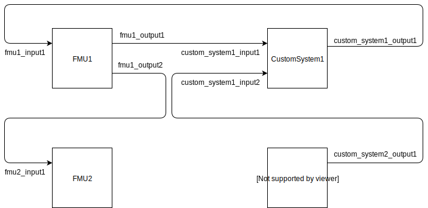

Connect systems
===============

The following example demonstrates how multiple systems can be connected for the simulation.

Consider the following systems.

For each input of a system it must be defined with which output of another system the
input is to be connected.
For the shown system the variables 'fmu_infos' and 'model_infos' must be defined as follows.
The variables 'fmu_infos' and 'model_infos' are inputs for the
:py:func:`simulate() <sofirpy.simulation.simulation.simulate>`
function.

.. code-block:: python3

    >>> fmu_infos = [
    ... {"name": "FMU1",
    ...  "path": "<path to the fmu>",
    ...  "connections":
    ...     [
    ...     {
    ...         "parameter name": "fmu1_input1",
    ...         "connect to system": "CustomSystem1",
    ...         "connect to external parameter": "custom_system1_output1"
    ...         }
    ...     ]
    ...     },
    ... {"name": "FMU2",
    ...  "path": "<path to the fmu>",
    ...  "connections":
    ...     [
    ...     {
    ...         "parameter name": "fmu2_input1",
    ...         "connect to system": "FMU1",
    ...         "connect to external parameter": "fmu1_output2"
    ...        }
    ... }
    ... ]
    >>> model_infos = [
    ... {"name": "CustomSystem1",
    ...  "connections":
    ...     [
    ...     {
    ...         "parameter name": "custom_system1_input1",
    ...         "connect to system": "FMU1",
    ...         "connect to external parameter": "fmu1_output1"
    ...         },
    ...     {
    ...         "parameter name": "custom_system1_input2",
    ...         "connect to system": "CustomSystem2",
    ...         "connect to external parameter": "custom_system2_output1"
    ...         }
    ...     ]
    ...     },
    ... {"name": "CustomSystem2"} # CustomSystem2 has no input so not connections need to be defined
    ... ]
